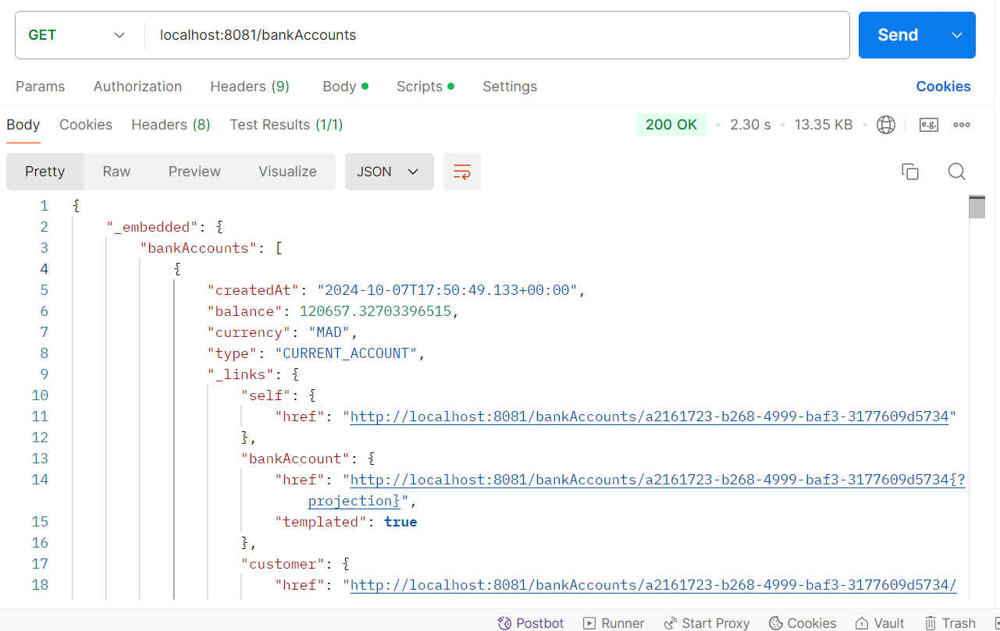
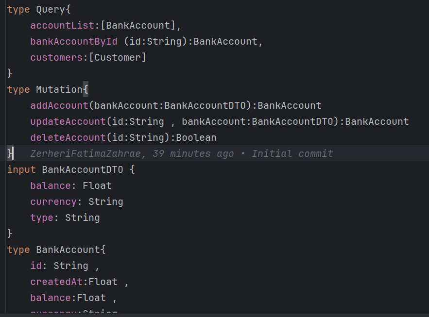

<h1>Spring Boot Microservice Project</h1>

<h2>Project Overview</h2>

This project is a Spring Boot microservice that manages accounts. It involves creating a JPA entity, a repository interface, a RESTful web service, testing the API using Postman, generating Swagger documentation, and implementing GraphQL.

<h2>Prerequisites</h2>
<ul>
    <li>Java 11 or later</li>
    <li>Spring Boot 2.x+</li>
    <li>Maven or Gradle</li>
    <li>Postman</li>
    <li>IDE (IntelliJ IDEA, Eclipse, etc.)</li>
</ul>
<h2>2. Create the JPA Entity: Compte</h2>

Steps:

<h2>3. Create the Repository Interface</h2>

Steps:

<h2>4. Test the DAO Layer</h2>

Steps:

<ol>
    <li>Create a <code>CommandLineRunner</code> to prepopulate the H2 database with <code>Compte</code> data.</li>
    <li>Test the repository methods like <code>save</code>, <code>findAll</code>, etc.</li>
</ol>
<pre>
@Bean
CommandLineRunner start(CompteRepository compteRepository) {
    return args -> {
        compteRepository.save(new Compte(null, 5000.0, "EUR"));
        compteRepository.save(new Compte(null, 10000.0, "USD"));
    };
}
</pre>
<h2>5. Create a RESTful Web Service</h2>

Steps:

<ol>
    <li>Create a <code>CompteController</code> class annotated with <code>@RestController</code>.</li>
    <li>Define endpoints for CRUD operations using <code>CompteRepository</code>.</li>
</ol>

<h2>6. Test the API using Postman</h2>

Steps:

<ol>
    <li>Start your Spring Boot application.</li>
    <li>Open Postman and send a GET request to <code>http://localhost:8081/bankAccounts</code> to retrieve accounts.</li>
</ol>

<h2>7. Generate Swagger Documentation</h2>

Steps:

<ol>
    <li>Add the <strong>Springfox Swagger</strong> dependency to your project.</li>
    <li>Annotate your controller methods and enable Swagger by visiting <code>http://localhost:8081/swagger-ui.html</code>.</li>
</ol>

<h2>8. Expose API using Spring Data Rest & Projections</h2>

Steps:

<ol>
    <li>Add <strong>Spring Data REST</strong> dependency.</li>
    <li>Create projections to customize data returned by the repository.</li>
</ol>

<h2>9. Create DTOs and Mappers</h2>

Steps:

<ol>
    <li>Create DTO classes for transferring data.</li>
    <li>Use <strong>MapStruct</strong> or manual mapping for converting between entities and DTOs.</li>
</ol>

<h2>10. Create the Service Layer</h2>

Steps:

<ol>
    <li>Implement the business logic inside a service class annotated with <code>@Service</code>.</li>
    <li>Use the service in your controller for cleaner code separation.</li>
</ol>

<h2>11. Implement GraphQL</h2>

Steps:

